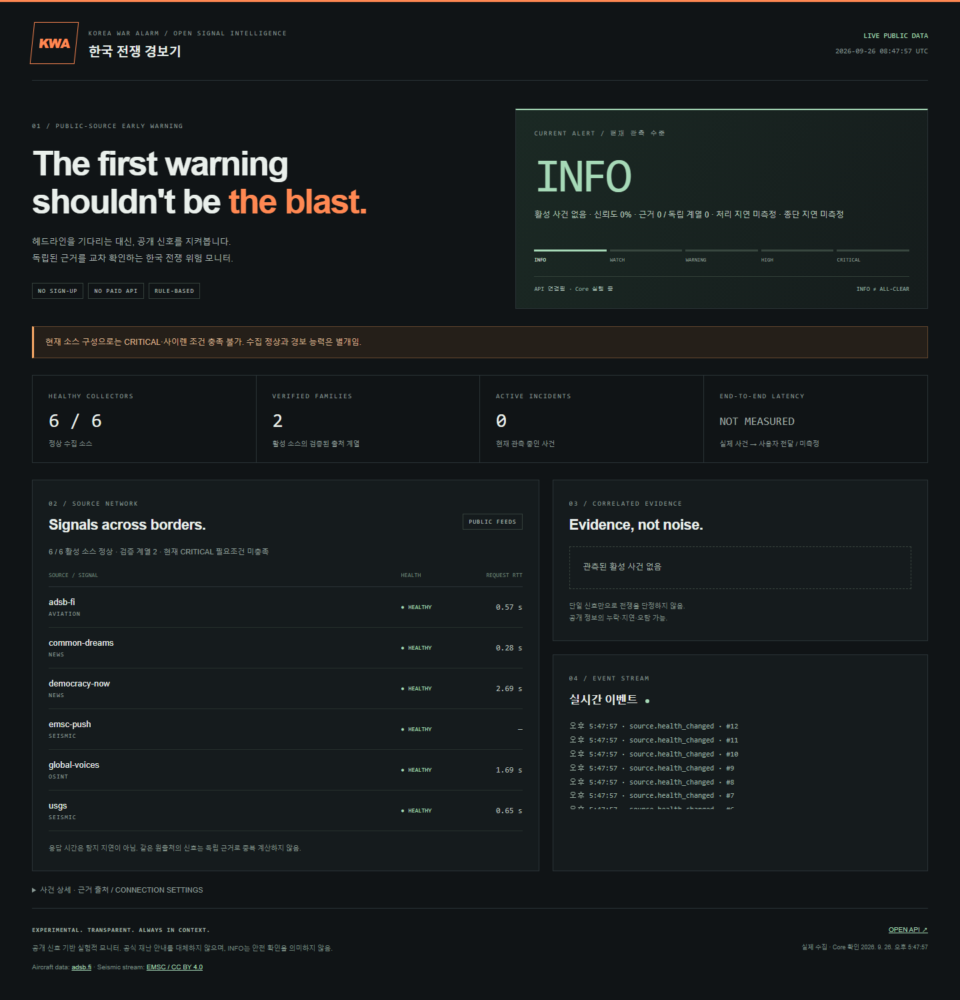

# 한국 전쟁 경보기

[English](README.md) | **한국어**

## 한반도 전쟁 발발 소식을, 가능한 한 빠르게.

**해외 보도·지진 관측·항공 신호를 상시 수집하고, 관련 근거를 연결해 사용자에게 전달하는 한반도 전쟁 조기 인지 솔루션.**



[Windows 실행](#windows-실행) · [수집 소스 보기](#기본-수집) · [API·외부 연동](docs/API.md)

### 프로젝트의 목표

한국 전쟁 경보기는 **한반도에서 전쟁이나 무력공격이 발생했을 때, 그 소식을 가능한 한 빠르게 파악하는 것**을 목표로 한다. 여러 곳에 흩어진 공개 보도와 관측 데이터를 지속적으로 수집하고, 같은 사건에 관한 근거를 연결해 대시보드와 설정된 알림 경로로 전달한다. 정보가 공개된 시점부터 사용자가 확인하기까지의 시간을 줄이는 데 초점을 맞춘다.

### 정보 수집 원칙

접근 가능한 정보원 중 원출처를 추적할 수 있고 상호 검증이 가능한 신호를 우선한다. 현재 USGS 지진 관측, EMSC를 통해 전달되는 검증된 USGS/NEIC 관측, 해외 뉴스·시민 저널리즘, adsb.fi의 민간 항공 비상 신호를 결합한다.

각 정보원은 역할과 신뢰도를 구분해 판정에 반영한다.

수집한 정보는 시간·위치·원출처를 기준으로 대조한다. 동일 발표를 재인용한 보도는 같은 출처 계열로 묶고, 서로 독립된 근거를 바탕으로 규칙 기반의 사건 판정을 수행한다.

### 핵심 기능

- **상시 수집** — 폴링과 WebSocket으로 공개 피드의 변화를 추적한다.
- **사건 교차 확인** — 시간·위치·사건 유형으로 관련 근거를 연결하고 원출처 중복을 구분한다.
- **실시간 대시보드** — 경보 단계, 진행 중인 사건, 판단 근거, 수집기 상태와 처리 지표를 한 화면에 표시한다.
- **알림·외부 연동** — 데스크톱 알림, REST, SSE, WebSocket, webhook, MQTT로 상태 변화를 전달한다.
- **로컬 실행** — 수집기·판정 엔진·저장소·대시보드를 사용자 환경에서 실행한다. Windows 배포본에는 실행 환경이 포함된다.

## Windows 실행

1. 배포 ZIP을 원하는 폴더에 푼다.
2. `kwa/kwa.exe`를 실행한다.
3. 기본 설정이 자동 생성되고 브라우저에 <http://127.0.0.1:8080/>이 열린다.

데이터·설정·로그는 `%LOCALAPPDATA%/KoreaWarAlarm/`에 저장한다.
콘솔의 Ctrl+C로 정상 종료한다. Windows 콘솔 강제 종료 시 자식 프로세스도 정리된다.
8080 포트 사용 중이면 `kwa.exe launch --port 8081`로 실행한다.
앱은 자체 코드 서명 인증서가 없어 Windows 다운로드/SmartScreen 안내가 표시될 수 있다.

## 기본 수집

| 소스 | 용도 |
|---|---|
| Democracy Now! | 공개 뉴스 RSS |
| Common Dreams | 공개 뉴스 RSS |
| Global Voices | 시민 저널리즘·OSINT RSS |
| USGS | 한반도 주변 지진 관측 |
| EMSC WebSocket | 검증된 USGS/NEIC 지진 관측 push 경로 |
| adsb.fi | 민간 항공 비상 신호, WATCH만 허용 |

신규 설치는 6개가 기본 활성화된다. 기존 설정은 덮어쓰지 않으므로 추가 신호 사용 시 `config.example.yaml`의 검증된 항목을 기존 설정에 추가한다.
원출처를 확인하지 못한 보도는 WATCH까지만 반영하고 독립 증거로 부풀리지 않는다.
CRITICAL은 직접 공격·독립 고신뢰 근거·물리 관측/해외 경보의 교차 확인이 있어야 한다.

`kwa latency --json`으로 로컬 처리 지연과 사건 관측 나이를 구분해 조회한다. 수집 구조는 [Source Layer v2](docs/SOURCE_LAYER_V2.md), 점수 산정과 출처 조건은 [판정 정책](docs/ALERT_POLICY.md)에서 확인할 수 있다.

기본 구성은 개인의 비상업 로컬 열람용이다. 코드 배포 라이선스는 MIT이며 뉴스 콘텐츠에는 각 제공자의 별도 이용 조건이 적용된다.
배포 ZIP에 뉴스 원문·실제 수집 DB·키를 포함하지 않는다. [소스·이용 조건](docs/SOURCES.md) 참고.

## 소스에서 실행

Python 3.12+, uv를 사용한다. 빌드된 WebUI가 저장소에 포함되어 일반 실행에 npm은 필요하지 않다.

```powershell
uv sync --locked --extra desktop --extra mqtt --extra dev
uv run kwa launch
```

또는 설정 위치와 프로세스를 직접 관리한다.

```powershell
uv run kwa init --directory ./local
uv run kwa run --config ./local/config.yaml
```

`kwa core`와 `kwa serve`를 각각 실행해도 된다. 두 명령에 같은 `--config`를 지정한다.
DB 상대 경로는 실행 디렉터리가 아니라 설정 파일 위치를 기준으로 해석한다.
`run`은 Core/API 종료 시 backoff 후 재시작하며 5회 연속 실패하면 로그를 남기고 종료한다.

## 조회·검증

```powershell
curl.exe http://127.0.0.1:8080/api/v1/alert/simple
uv run kwa status --json
uv run kwa alert --json
uv run kwa watch
uv run kwa doctor --config ./local/config.yaml
uv run kwa backup --config ./local/config.yaml --output ./backup.sqlite
uv run kwa replay tests/fixtures/synthetic_attack.json
uv run kwa replay tests/fixtures/historical_dprk_2017.json
```

`doctor`는 설정과 설치 조건을 확인한다.
`/api/v1/ready`는 Core heartbeat와 활성 소스 정상 여부를 확인하며 준비 안 됐으면 HTTP 503을 반환한다.
CLI 종료 코드: 정상/INFO/WATCH 0, WARNING 2, HIGH 3, CRITICAL 4, 오류 10, replay 실패 11, doctor 미준비 12.

## 개발·배포 빌드

```powershell
uv sync --locked --extra dev --extra bundle
Push-Location web
npm ci
npm run build
npm test
Pop-Location
uv run pytest -q
uv run ruff check src tests scripts
uv run python scripts/build_release.py
uv run python scripts/smoke_release.py dist/kwa/kwa.exe
```

브라우저 테스트 최초 실행에 `npx playwright install chromium`가 필요하다.
Windows/macOS/Linux 빌드는 해당 OS에서 수행한다. GitHub Actions는 테스트·OS별 ZIP·SHA-256을 생성하며 tag push 시 draft release를 만든다.

## 외부 연동

REST/SSE/WebSocket 및 선택적 webhook·MQTT를 제공한다. 모두 로컬 동작과 독립적이다.
LAN에 직접 노출하려는 경우에만 운영자가 자체 `KWA_API_TOKEN` 환경변수를 설정한다.
이 토큰은 로컬 서버의 접근 인증에 사용한다.
데스크톱 알림과 Windows 사이렌을 포함한다. 합성 replay는 실제 소리를 내지 않는다.

[API](docs/API.md) · [연동 예제](docs/INTEGRATIONS.md) · [판정 정책](docs/ALERT_POLICY.md) · [보안](docs/SECURITY.md)
[구현 상세](docs/IMPLEMENTATION.md) · [검증 기록](docs/RELEASE_CHECKS.md)
